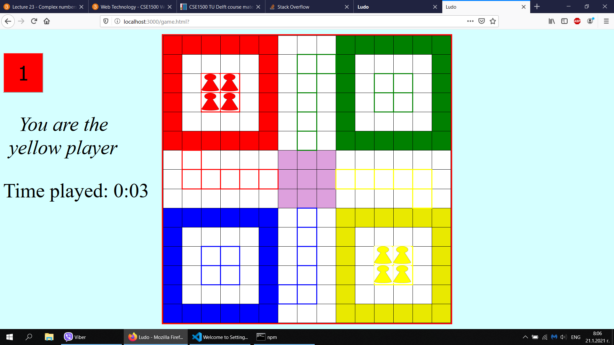

# LUDO GAME



Make sure that you have [Node.js](https://nodejs.org/en/) installed as well as [git](https://git-scm.com/).

To start the game, execute the following steps in the terminal:

```console
npm install express-generator
node node_modules/express-generator/bin/express-cli.js --view=ejs myapp
npm install
npm start
```

You can now access the game at [http://localhost:3000/](http://localhost:3000/) in the browser. Open another browser window to access the game as another player.

If you want to change the port two actions are required: 

1. Alter `myapp/package.json` (change the line `node app.js 3000` and replace `3000` with your preferred port).
2. Alter `myapp/public/javascripts/config.js` (the port of the Websocket URL).

A click on the "Play" button brings you to the game. If you are the firts player in the game, you are with the red pawns. If you are the second one, you play with
yellow pawns. The color of the dice indicates who player (the red or yellow one has the turn).In order to move a pawn you have to press the dice. A pawn gets out of the home after you throw 6 
